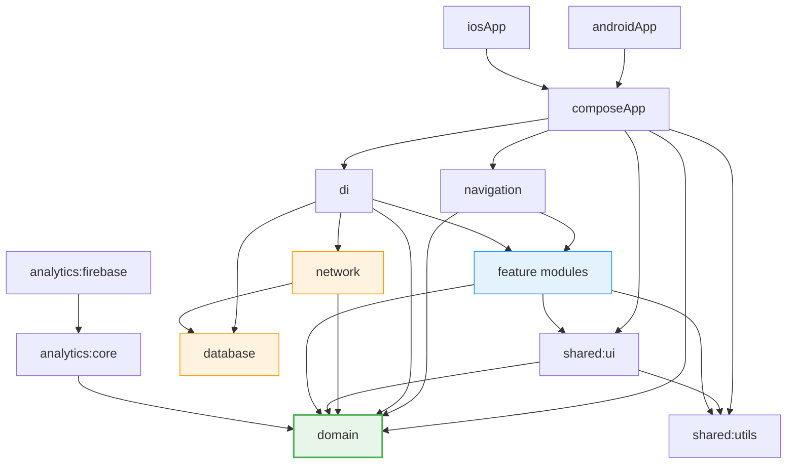

# NutriSport

**Cross-platform sports nutrition e-commerce app** built with Kotlin Multiplatform and Compose Multiplatform.


## Tech Stack

| Technology                                                                                                          | Version | Purpose                                    |
| ------------------------------------------------------------------------------------------------------------------- | ------- | ------------------------------------------ |
| [Kotlin Multiplatform](https://kotlinlang.org/docs/multiplatform.html)                                              | 2.3.20  | Shared business logic across Android & iOS |
| [Compose Multiplatform](https://www.jetbrains.com/compose-multiplatform/)                                           | 1.10.2  | Shared UI framework                        |
| [Firebase](https://firebase.google.com/) (via [GitLive SDK](https://github.com/nicholasgasior/firebase-kotlin-sdk)) | 2.4.0   | Auth, Firestore, Storage                   |
| [Room KMP](https://developer.android.com/kotlin/multiplatform/room)                                                 | 2.8.4   | Local database / offline cache             |
| [Koin](https://insert-koin.io/)                                                                                     | 4.2.0   | Dependency injection                       |
| [Ktor](https://ktor.io/)                                                                                            | 3.4.1   | HTTP client                                |
| [Coil 3](https://coil-kt.github.io/coil/)                                                                           | 3.4.0   | Image loading                              |
| [KMPAuth](https://github.com/nicholasgasior/kmpauth)                                                                | 2.3.1   | Google Sign-In (KMP)                       |
| [Napier](https://github.com/nicholasgasior/napier)                                                                  | 2.7.1   | Multiplatform logging                      |
| [Detekt](https://detekt.dev/)                                                                                       | 1.23.8  | Static code analysis                       |

## Architecture

NutriSport follows **Clean Architecture** with a strict module dependency graph. Domain is pure — no platform code, no framework dependencies.



### Clean Architecture Layers

```
┌─────────────────────────────────────────────────────────┐
│  Presentation (feature/*)                               │
│  ViewModels, Screens, UI models, Route-Screen pattern   │
├─────────────────────────────────────────────────────────┤
│  Domain (:domain) — pure Kotlin                         │
│  Models, Repository interfaces, Use Cases, Either       │
├─────────────────────────────────────────────────────────┤
│  Data (:network + :database)                            │
│  Firebase repos, DTOs, Room entities, mappers           │
└─────────────────────────────────────────────────────────┘
```

**Data flow:** `DocumentSnapshot → Dto → Entity → Domain model → UI model`

### Error Handling

Type-safe errors with no exceptions crossing layer boundaries:

- **Domain/Data:** `DomainResult<T>` = `Either<AppError, T>` — `Network`, `NotFound`, `Unauthorized`, `Unknown`
- **Presentation:** `UiState<T>` — `Idle`, `Loading`, `Content(DomainResult<T>)`

## Module Structure

| Module                                        | Description                                                          |
| --------------------------------------------- | -------------------------------------------------------------------- |
| `androidApp`                                  | Android entry point (Activity, Application, splash screen)           |
| `composeApp`                                  | Shared KMP entry — `AppContent` composable                           |
| `navigation`                                  | NavHost + type-safe routing (`SetupNavGraph`)                        |
| `domain`                                      | Pure domain: models, repo interfaces, use cases, `Either`/`AppError` |
| `shared:utils`                                | Constants, `AppConfig`, `FormatPrice`, `Log`, `Screen.kt` (routes)   |
| `shared:ui`                                   | Reusable Compose components, `UiState`, `DisplayResult`, resources   |
| `shared:testing`                              | Test fixtures: fake data factories, fake repositories                |
| `network`                                     | Data layer: Firebase repositories, DTOs, mappers                     |
| `database`                                    | Room KMP: entities, DAOs, local cache                                |
| `di`                                          | Koin DI wiring (shared + platform modules)                           |
| `analytics:core`                              | Analytics abstraction layer                                          |
| `analytics:firebase`                          | Firebase Analytics implementation                                    |
| `feature:auth`                                | Authentication (Google Sign-In)                                      |
| `feature:home`                                | Home screen shell                                                    |
| `feature:home:categories`                     | Product categories grid                                              |
| `feature:home:categories:search`              | Product search & filtering                                           |
| `feature:home:productsOverview`               | Products list by category                                            |
| `feature:home:cart`                           | Shopping cart                                                        |
| `feature:home:cart:checkout`                  | Checkout flow                                                        |
| `feature:home:cart:checkout:paymentCompleted` | Payment confirmation                                                 |
| `feature:details`                             | Product detail page                                                  |
| `feature:profile`                             | User profile                                                         |
| `feature:adminPanel`                          | Admin dashboard                                                      |
| `feature:adminPanel:manageProduct`            | Product CRUD for admins                                              |
| `build-logic`                                 | Convention plugins (`library`, `feature`, `feature.full`)            |
| `benchmark`                                   | Macrobenchmark + Baseline Profiles                                   |

## Getting Started

### Prerequisites

- **JDK 21** (project uses `jvmToolchain(21)`)
- **Android Studio** Ladybug or later (with KMP plugin)
- **Xcode 16+** (for iOS builds)
- Firebase project configured with `google-services.json` (Android) and `GoogleService-Info.plist` (iOS)

### Setup

```bash
git clone https://github.com/satanyakiv/NutriSport.git
cd NutriSport
```

Place your Firebase config files:

- `androidApp/google-services.json`
- `iosApp/iosApp/GoogleService-Info.plist`

### Build & Run

```bash
# Android debug build
./gradlew assembleDebug

# Quick compile check (common code)
./gradlew :domain:compileCommonMainKotlinMetadata

# iOS compile check
./gradlew :composeApp:compileIosMainKotlinMetadata

# Code style
./gradlew detekt
```

For iOS — open `iosApp/` in Xcode and run, or use the KMP run configuration in Android Studio.

## Testing

All tests run on **JVM** — no emulator or device required.

| Layer      | Framework                             | Runner                  |
| ---------- | ------------------------------------- | ----------------------- |
| Unit tests | `kotlin.test` + `assertk` + `mokkery` | `commonTest` (JVM host) |
| Flow tests | `turbine`                             | `commonTest`            |
| UI tests   | `compose.uiTest` + Robolectric        | `androidHostTest`       |
| Coverage   | Kover 0.9.7                           | JVM/Android only        |

```bash
# Run specific test class
./gradlew :feature:home:cart:allTests --tests "*CartViewModelTest"

# Run all tests in a module
./gradlew :feature:home:cart:allTests

# Coverage report
./gradlew koverHtmlReport

# Verify coverage thresholds
./gradlew koverVerify
```

See [docs/TESTING.md](docs/TESTING.md) for the full testing guide.

## Screenshots

<!-- TODO: add screenshots -->

## CI/CD

See [docs/CI.md](docs/CI.md) for CI/CD documentation — GitHub Actions workflows, secrets, and Fastlane setup.

## License

```
MIT License

Copyright (c) 2025 NutriSport

Permission is hereby granted, free of charge, to any person obtaining a copy
of this software and associated documentation files (the "Software"), to deal
in the Software without restriction, including without limitation the rights
to use, copy, modify, merge, publish, distribute, sublicense, and/or sell
copies of the Software, and to permit persons to whom the Software is
furnished to do so, subject to the following conditions:

The above copyright notice and this permission notice shall be included in all
copies or substantial portions of the Software.

THE SOFTWARE IS PROVIDED "AS IS", WITHOUT WARRANTY OF ANY KIND, EXPRESS OR
IMPLIED, INCLUDING BUT NOT LIMITED TO THE WARRANTIES OF MERCHANTABILITY,
FITNESS FOR A PARTICULAR PURPOSE AND NONINFRINGEMENT. IN NO EVENT SHALL THE
AUTHORS OR COPYRIGHT HOLDERS BE LIABLE FOR ANY CLAIM, DAMAGES OR OTHER
LIABILITY, WHETHER IN AN ACTION OF CONTRACT, TORT OR OTHERWISE, ARISING FROM,
OUT OF OR IN CONNECTION WITH THE SOFTWARE OR THE USE OR OTHER DEALINGS IN THE
SOFTWARE.
```
