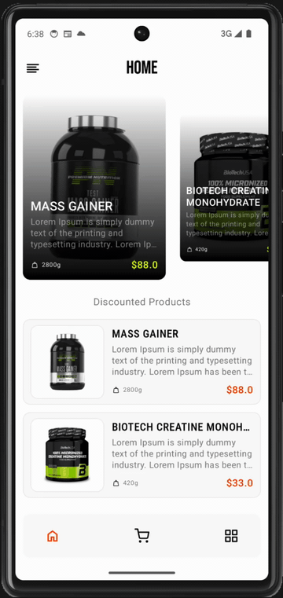
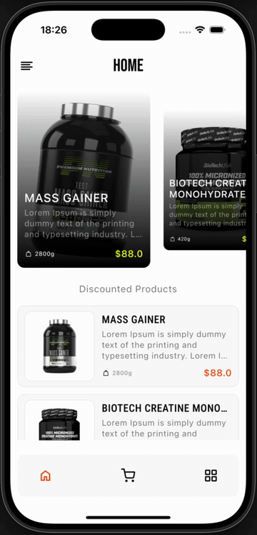
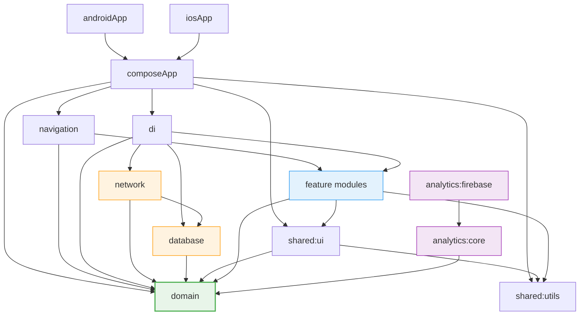

# NutriSport

A 25-module Kotlin Multiplatform e-commerce app built to demonstrate production engineering — offline-first architecture, CI/CD to both stores, OWASP-hardened security, and AI-assisted development — at portfolio scale.

## Demo

| Android                                  | iOS                              |
| ---------------------------------------- | -------------------------------- |
|  |  |

## Try It

The app uses Firebase with restricted access — only approved Google accounts can sign in.

**Want to test it?** [Email me](mailto:yakiv.bondar@gmail.com) or [open an issue](https://github.com/satanyakiv/NutriSport/issues) — I'll add your Google account within 24 hours.

What happens behind the scenes:

1. Your email gets added to the Google Cloud OAuth test users list
2. Your account gets authorized in Firebase Auth
3. You receive a debug APK via Firebase App Distribution

---

## Table of Contents

- [Try It](#try-it)
- [Why E-Commerce Is Hard](#why-e-commerce-is-hard)
- [The Solution](#the-solution)
- [Demo](#demo)
- [Architecture](#architecture)
- [Engineering Highlights](#engineering-highlights)
- [AI-Assisted Development](#ai-assisted-development)
- [Tech Stack](#tech-stack)
- [Documentation](#documentation)
- [Roadmap](#roadmap)
- [License](#license)

---

ю

## Why E-Commerce Is Hard

Requirements mutate constantly. A new promo rule, a changed discount tier, an edge case in cart validation — in e-commerce, the business logic layer takes more hits than any other part of the system. If it is tangled with platform code, every change becomes a surgery.

Data is never clean. Prices go stale mid-session, inventory updates while the user is checking out, and network drops during payment. An app that only works online is an app that loses orders. Offline-first is not a nice-to-have — it is the difference between a completed checkout and an abandoned cart.

Security is table stakes. Client-side authorization bypasses, PII lingering after sign-out, cleartext traffic — one finding in production and users lose trust. OWASP is not a checkbox exercise; it is an engineering constraint that shapes every layer.

**Most portfolio apps demonstrate UI skills. This one demonstrates the engineering discipline that keeps an e-commerce product alive after launch.**

## The Solution

- **Clean Architecture across 25 KMP modules** — domain logic changes without recompiling platform or UI layers. 3 convention plugins enforce consistency across every module.
- **Offline-first with Room as single source of truth** — UI always reads from local cache, Firebase syncs in background, price tracking catches mid-session changes at checkout.
- **OWASP-hardened** — server-side admin auth via Firestore rules, HTTPS-only network config, Room + cart cleared on sign-out, zero secrets in git.
- **4 CI/CD pipelines** — PR validation with lint + test + coverage, debug deploy to Firebase App Distribution, tag-triggered signed release, iOS via Fastlane + TestFlight.
- **169 tests across 34 files** — domain use cases at 98% coverage, ViewModels tested with Turbine + Fake repositories, UI smoke tests running on JVM via Robolectric (~30s full run, no emulator).
- **AI development infrastructure** — `.claude/` directory with agents, commands, skills, rules, and hooks that enforce architecture automatically. Any team member — human or AI — follows the same standards.

## Architecture

Business logic changes weekly in e-commerce. Clean Architecture ensures those changes stay in the domain layer — no platform recompilation, no UI side effects, every layer testable in isolation.

**Data flow:** `Firestore snapshot → Dto → Room Entity → Domain Model → UI Model → Composable`

### Key Decisions

| Decision                                              | Why it matters for e-commerce                                                           |
| ----------------------------------------------------- | --------------------------------------------------------------------------------------- |
| Pure domain module (zero project deps)                | New promo rules or discount logic deploy without recompiling data or UI layers          |
| 4-layer model separation (Dto → Entity → Domain → Ui) | A Firestore schema change never breaks the cart screen                                  |
| Strategy pattern for build types                      | Crashlytics, debug toolkit, Firebase config — per variant, zero `if (isDebug)` anywhere |
| Room SSOT with background Firebase sync               | UI stays responsive during network drops; stale prices caught before checkout           |
| Type-safe errors (`Either<AppError, T>`)              | No exceptions cross layer boundaries — every failure path is explicit and testable      |
| Convention plugins (library, feature, feature.full)   | 25 modules stay consistent without manual Gradle configuration                          |

Module structure (25 modules)

| Module                                        | Description                                                          |
| --------------------------------------------- | -------------------------------------------------------------------- |
| `androidApp`                                  | Android entry point (Activity, Application, splash screen)           |
| `composeApp`                                  | Shared KMP entry — `AppContent` composable                           |
| `navigation`                                  | NavHost + type-safe routing (`SetupNavGraph`)                        |
| `domain`                                      | Pure domain: models, repo interfaces, use cases, `Either`/`AppError` |
| `shared:utils`                                | Constants, `AppConfig`, `FormatPrice`, `Log`, `Screen.kt` (routes)   |
| `shared:ui`                                   | Reusable Compose components, `UiState`, `DisplayResult`, resources   |
| `shared:testing`                              | Test fixtures: fake data factories, fake repositories                |
| `network`                                     | Data layer: Firebase repositories, DTOs, mappers                     |
| `database`                                    | Room KMP: entities, DAOs, local cache                                |
| `di`                                          | Koin DI wiring (shared + platform modules)                           |
| `analytics:core`                              | Analytics abstraction layer                                          |
| `analytics:firebase`                          | Firebase Analytics implementation                                    |
| `feature:auth`                                | Authentication (Google Sign-In)                                      |
| `feature:home`                                | Home screen shell                                                    |
| `feature:home:categories`                     | Product categories grid                                              |
| `feature:home:categories:search`              | Product search and filtering                                         |
| `feature:home:productsOverview`               | Products list by category                                            |
| `feature:home:cart`                           | Shopping cart                                                        |
| `feature:home:cart:checkout`                  | Checkout flow                                                        |
| `feature:home:cart:checkout:paymentCompleted` | Payment confirmation                                                 |
| `feature:details`                             | Product detail page                                                  |
| `feature:profile`                             | User profile                                                         |
| `feature:adminPanel`                          | Admin dashboard                                                      |
| `feature:adminPanel:manageProduct`            | Product CRUD for admins                                              |
| `benchmark`                                   | Macrobenchmark + Baseline Profiles                                   |

## Engineering Highlights

### CI/CD

| Workflow                                               | Trigger      | Pipeline                                                                  |
| ------------------------------------------------------ | ------------ | ------------------------------------------------------------------------- |
| [`pr.yml`](.github/workflows/pr.yml)                   | Pull request | Detekt → Build → Test → Coverage + iOS simulator build                    |
| [`debug.yml`](.github/workflows/debug.yml)             | Push to main | Lint → Build → Test → Firebase App Distribution                           |
| [`release.yml`](.github/workflows/release.yml)         | Git tag `v*` | Signed APK → Firebase App Distribution                                    |
| [`ios-release.yml`](.github/workflows/ios-release.yml) | Manual       | K/Native → Fastlane Match → TestFlight (requires Apple Developer Program) |

Auto-versioning from git tags. Android tests run on JVM — no emulator in CI. [Full CI/CD docs](docs/CI.md)

### Testing

169 tests across 34 files. All JVM — full run takes ~30 seconds, no emulator.

<!-- coverage:start -->
| Package | Line coverage |
| ------- | ------------- |
| domain:usecase | 98.8% |
| feature:productsOverview | 90.3% |
| feature:details | 90.1% |
| feature:cart | 86.6% |
| domain:models | 84.0% |
| analytics:core | 77.4% |
| shared:utils | 76.9% |
| feature:profile | 65.0% |
| feature:categories:search | 46.4% |
| analytics:firebase | 45.2% |
| feature:adminPanel | 30.0% |
| feature:manageProduct | 22.2% |
| feature:auth | 13.5% |
| feature:home | 9.5% |
| network | 0.0% |
| feature:paymentCompleted | 0.0% |
| feature:checkout | 0.0% |

> Overall line coverage: 37.5%. Low aggregate reflects untested generated code, UI composables, and data layer — tested packages average 80%+. Report: 2026-03-30.
<!-- coverage:end -->

Stack: `kotlin.test` + `Turbine` + `Mokkery` + `Assertk` + `Robolectric` + `Kover`. [Full testing docs](docs/TESTING.md)

### Security

OWASP Mobile Top-10 informed security review. Key fixes applied:

| OWASP                   | What was done                                                                  |
| ----------------------- | ------------------------------------------------------------------------------ |
| M1 — Credential storage | Secrets removed from git, Firebase configs via CI secrets + `local.properties` |
| M3 — Auth/Authorization | Server-side admin verification via Firestore rules (`isAdmin()` helper)        |
| M5 — Network            | HTTPS-only via `network_security_config.xml`, cleartext blocked                |
| M9 — Data cleanup       | Room cache + cart cleared on `signOut()`, PII removed from logs                |

[Full security audit](docs/SECURITY.md) · [Firebase setup and rules](docs/FIREBASE_SETUP.md)

### Performance and Observability

Baseline Profiles generated via `:benchmark` module with fake data (deterministic, fully offline). Macrobenchmarks measure cold startup across compilation modes. R8 + resource shrinking in release builds.

Crash reporting: Firebase Crashlytics in release builds, [Tracey flight recorder](docs/TRACEY.md) in debug (gesture capture, navigation breadcrumbs, crash dumps). [Crashlytics docs](docs/CRASHLYTICS.md) · [Performance docs](docs/PERFORMANCE.md)

## AI-Assisted Development

The `.claude/` directory is not a collection of prompts — it is a **development standards encoded as executable constraints**. Architecture rules, testing patterns, security policies, and development workflows are encoded as executable constraints. Any engineer joining the project — human or AI — works under the same standards from day one.

### Infrastructure

| Component     | Count | Examples                                                                                            |
| ------------- | ----- | --------------------------------------------------------------------------------------------------- |
| Agents        | 3     | Architecture reviewer, OWASP security auditor, Crash analyzer                                       |
| Commands      | 6     | `/fix` (TDD), `/refactor`, `/clean-arch`, `/debug-deps`, `/security-audit`, `/debug-crash`          |
| Skills        | 7     | Test generation, Feature scaffolding, Coverage analysis, Feature orchestration, Live crash analysis |
| Rules         | 8     | Architecture, Conventions, Testing, Models, Error handling, Docs, Prompts, Plan mode                |
| Feature plans | 13    | Orchestrated across 5 parallel groups with conflict matrix                                          |
| Hooks         | 2     | PreToolUse blocks editing secrets files; PostToolUse auto-detects crashes in logs                   |

### What This Means in Practice

- **Architecture enforcement** — `/clean-arch` validates dependency flow and layer boundaries before code review happens
- **Automated TDD** — `/fix` follows Red-Green-Refactor: reproduce issue → write failing test → minimal fix → verify
- **Live crash triage** — Crashlytics MCP integration fetches production crash data, correlates stacktraces with source code, suggests fixes
- **Parallel feature development** — orchestrator defines 5 execution groups with a conflict matrix; git worktrees isolate parallel work on shared files

Full AI infrastructure: [CLAUDE.md](CLAUDE.md)

## Tech Stack

| Category          | Technologies                                                         |
| ----------------- | -------------------------------------------------------------------- |
| Language and UI   | Kotlin 2.3.20, Compose Multiplatform 1.10.2                          |
| Backend           | Firebase (GitLive SDK 2.4.0) — Auth, Firestore, Storage, Crashlytics |
| Local storage     | Room KMP 2.8.4, SQLite Bundled 2.6.2                                 |
| DI                | Koin 4.2.0                                                           |
| Networking        | Ktor 3.4.1 (Android + Darwin engines)                                |
| Images            | Coil 3 (3.4.0) with Ktor network backend                             |
| Build and Quality | AGP 9.1.0, Detekt 1.23.8 (strict, maxIssues: 0), Kover 0.9.7         |

Full dependency list

| Dependency            | Version       | Purpose                                 |
| --------------------- | ------------- | --------------------------------------- |
| Kotlin Multiplatform  | 2.3.20        | Shared code across Android and iOS      |
| Compose Multiplatform | 1.10.2        | Shared UI framework                     |
| Firebase BOM          | 33.1.2        | Firebase version alignment              |
| GitLive Firebase SDK  | 2.4.0         | KMP Firebase (Auth, Firestore, Storage) |
| Room KMP              | 2.8.4         | Local database and offline cache        |
| Koin                  | 4.2.0         | Dependency injection                    |
| Ktor                  | 3.4.1         | HTTP client                             |
| Coil 3                | 3.4.0         | Image loading                           |
| KMPAuth               | 2.3.1         | Google Sign-In (KMP)                    |
| Napier                | 2.7.1         | Multiplatform logging                   |
| Kotlinx Coroutines    | 1.10.2        | Async and reactive streams              |
| Kotlinx Serialization | 1.8.1         | JSON serialization                      |
| Detekt                | 1.23.8        | Static analysis (strict mode)           |
| Kover                 | 0.9.7         | Code coverage (JVM/Android)             |
| Mokkery               | 3.2.0         | KMP mocking (compiler plugin)           |
| Turbine               | 1.2.1         | Flow testing                            |
| Assertk               | 0.28.1        | Fluent assertions                       |
| Robolectric           | 4.16          | JVM UI tests (androidHostTest)          |
| Baseline Profile      | 1.5.0-alpha04 | Cold start optimization                 |
| Tracey                | 0.0.2-RC      | Debug flight recorder                   |

## Documentation

| Document                                 | Covers                                                           |
| ---------------------------------------- | ---------------------------------------------------------------- |
| [CI/CD](docs/CI.md)                      | 4 GitHub Actions workflows, secrets, Fastlane, composite actions |
| [Testing](docs/TESTING.md)               | Test pyramid, 169 tests, Kover, Robolectric, recipes             |
| [Security](docs/SECURITY.md)             | OWASP Mobile Top-10 audit and applied fixes                      |
| [Performance](docs/PERFORMANCE.md)       | Baseline Profiles, macrobenchmarks, Compose stability plan       |
| [Offline-First](docs/OFFLINE_FIRST.md)   | Room SSOT, Firebase sync, ConnectivityObserver, price tracking   |
| [Crashlytics](docs/CRASHLYTICS.md)       | Firebase Crashlytics, Strategy pattern, MCP integration          |
| [Tracey](docs/TRACEY.md)                 | Debug flight recorder, gesture capture, crash dump analysis      |
| [Firebase Setup](docs/FIREBASE_SETUP.md) | Firestore rules, admin roles, config file management             |

## Roadmap

### Active

| Item                        | Description                                                              |
| --------------------------- | ------------------------------------------------------------------------ |
| UI Facelift                 | Material 3 Dynamic Color, design token system, dark theme                |
| E2E Test Suite              | Scenario-based coverage matrix (happy path, error, edge per screen)      |
| Test Strategy Formalization | Documented pyramid ratios, ownership matrix, flaky test policy, CI gates |

### Planned

| Item                   | Description                                                                          |
| ---------------------- | ------------------------------------------------------------------------------------ |
| Domain Layer Splitting | Per-feature domain modules (`:domain:cart`, `:domain:product`) for build parallelism |
| Feature Flags          | Remote Config-driven toggles, gradual rollout, A/B infrastructure                    |
| Modular Navigation     | Per-feature navigation graphs with deep linking support                              |
| Dependency Automation  | Renovate with auto-merge policy for minor/patch updates                              |

### Long-term

| Item                          | Description                                                       |
| ----------------------------- | ----------------------------------------------------------------- |
| Observability                 | Structured logging, OpenTelemetry tracing, performance dashboards |
| API Contract Testing          | Pact/schema validation between client and Cloud Functions         |
| Architecture Decision Records | Documented ADR log for significant technical choices              |
| Load and Stress Testing       | Firestore read/write limits simulation, concurrent user scenarios |

## License

[MIT](LICENSE)
